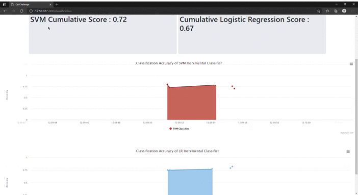

# QA Streaming ML Pipeline Challenge

## Step1
To create the image:
```
docker build -t qa-challenge . 
```
To run the image in a container:

```
docker run -d -p 5000:5000 qa-challenge 
```

## Step 2

To build the Api which incrementally load the data, i used the requests command.
To see an example, run the app in the terminal using:

```
python api/app.py
```

and then run the ingestion script:

```
python api/ingestion.py
```

The Api basically is a get request in which the parameter is page.
I created two function:

*get_page* and *get_pages* which return a pandas dataframe with a single page of the database and multiple pages of the
 database

Every page consist of 100 rows of the database

## Step 3

I created the web app in the same script of the api *api/app.py*

The home is this url: http://127.0.0.1:5000/

I've created 4 different routes:

- *classification*: route for classification algorithm
- *reg*: route for regression algorithm
- *data*: partial results of classification algorithm
- *datareg*: partial results of  regression algorithm

I've maintained the same Api endpoint: *api/v1/data*

To solve the problem of load data incrementally, and update the model incrementally, i used
global variabels to count the pages loaded, store the partial models, and store the cumulative results of the score.

I differentiated two kind of scores:
- partial score: score of the current page of the database
- cumulative score: mean score of all the pages loaded until the current page.


Both the algorithms, works with the same logic:
- load one page of data
- increment the counter of the pages loaded
- fit the partial models
- store partial and cumulative scores in a response object

As an example, in the *data* route, used to compute partial classification results:

```
    # modify global variables
    global pageClass, svm_mdl, lr_mdl, cum_class_score1, cum_class_score2

    # get stream of data
    stream = get_page(pageClass)

    # increment page for the next Api call
    pageClass = pageClass + 1
```
The first statement is needed to modify the global variables. Then the page *pageClass*, which refer to the page 
for classification algorithm, is loaded as a dataframe in the local stream variable. *pageClass* is then incremented.

Once the data are loaded, create local *X* and local *y* which are used to fit the models:


```
    # get X and y
    X, y = stream[features_classification], stream['promoted']

    # fit models and compute score with Cross Validation
    partial_res_svm = partial_classification_model(svm_mdl, X, y)
    partial_res_lr = partial_classification_model(lr_mdl, X, y)
```

Then, the global models are updatetd, the partial results are assigned to two local variables, and the 
cumulative scores are updated thank to the *update_score* function.

```
    # update list of models obj
    svm_mdl, lr_mdl = partial_res_svm['fitted_model'], partial_res_lr['fitted_model']

    # update partial scores
    score_svm, score_lr = partial_res_svm['cv_score'], partial_res_lr['cv_score']

    # update mean cumulative score
    cum_class_score1 = update_score(cum_class_score1, score_svm, pageClass)
    cum_class_score2 = update_score(cum_class_score2, score_lr, pageClass)

```

Finally, the data are encapsulated in a Response Object


```
    # send data
    data = [time() * 1000, score_svm, score_lr, cum_class_score1, cum_class_score2]

    # create response object
    response = make_response(json.dumps(data))
    response.content_type = 'application/json'

    return response

```

### Results
To show the results, I used two templates, *templates/classification_templates.html* and 
*templates/regression_templates.html* which both works with the same logic.

There are two sensors, which are displayed in the first part of the page, which display the value of the 
cumulative scores, and two scatter plots of the two models used, in which the X axis indicates the time of the computation, 
and the Y axis, indicates the Score of the model.



